## Contents
{:.no_toc}
*  
{: toc}


```python
#Import libraries
import pandas as pd
import numpy as np
import matplotlib.pyplot as plt
import xlrd
import csv
from os import listdir
from os.path import isfile, join
%matplotlib inline
import seaborn.apionly as sns
```


## 2 EDA

### 2.1 Load and combine dataframes


```python
fbi_data_path = 'Crime/data/fbi_data/'
```


```python
census_data_path = 'Crime/data/census/'
```


```python
fbi_filepaths = [f for f in listdir(fbi_data_path) if isfile(join(fbi_data_path, f))]
```


```python
csv_filepaths = [f for f in listdir('csvs/') if isfile(join('csvs/', f))]
```


```python
df_total = pd.read_csv(join('csvs/', csv_filepaths[0]))
columns = ['Metropolitan_Statistical_Area', 'Murder_and_nonnegligent_manslaughter' + '_' + csv_filepaths[0][:-4]]
df_total.columns = columns
for i in range(1, len(csv_filepaths)):
    file_path = join('csvs/', csv_filepaths[i])
    df = pd.read_csv(file_path)
    columns = ['Metropolitan_Statistical_Area', 'Murder_and_nonnegligent_manslaughter' + '_' + csv_filepaths[i][:-4]]
    df.columns = columns
    df_total = pd.merge(df_total, df, left_on='Metropolitan_Statistical_Area', right_on='Metropolitan_Statistical_Area', how='outer')
```


```python
fig, ax = plt.subplots(1, 1, figsize = (10, 10))
ax.plot(list(range(2006, 2017)), df_total.drop('Metropolitan_Statistical_Area', axis=1).sum().values)
ax.set_xlabel('Years')
ax.set_ylabel('Number of murders')
ax.set_title('Murder counts from 2006 - 2016')
```


    <matplotlib.text.Text at 0x1172b3cc0>


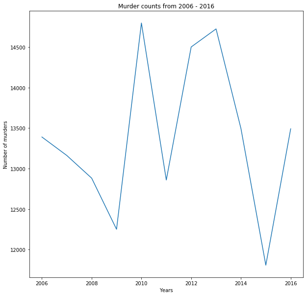


```python
census_folder_fps = [f for f in listdir(census_data_path) if isfile(join(census_data_path, f))]
```


```python
census_filepaths = [f for f in census_folder_fps if f[3:] == 'census.csv']
```


```python
def strip_dashes(x):
    return ' '.join(' '.join(x.split('-')).split())
```


```python
def merge_df_msa(fbi_df, census_df):
    census_mask = census_df['Geography'].isnull()
    fbi_mask = fbi_df['Metropolitan_Statistical_Area'].isnull()

    df_c = census_df[~census_mask]
    df_f = fbi_df[~fbi_mask]

    geos = df_c['Geography'].apply(lambda x: x.split('Metro Area')[0].strip())
    geos = geos.apply(strip_dashes)
    df_c['Geography'] = geos

    fbi_geos = df_f['Metropolitan_Statistical_Area'].apply(strip_dashes)
    df_f['Metropolitan_Statistical_Area'] = fbi_geos

    return pd.merge(df_f, df_c, left_on='Metropolitan_Statistical_Area', right_on='Geography', how='inner').drop('Geography', axis=1)

```


```python
df_dict = dict()
for i in range(0, 11):
    df_fbi = pd.read_csv(join('csvs/', csv_filepaths[i]))
    df_census = pd.read_csv(join(census_data_path, census_filepaths[i]), skiprows=1).drop(['Id', 'Id2'], axis=1)
    columns = [col for col in df_census.columns if 'Native' not in col and 'Margin of Error' not in col]
    foreign = [x for x in df_census.columns if 'born outside' in x][0]
    non_native = df_census[foreign]

    df_census = df_census[columns]
    df_census['non_native'] = non_native

    df = merge_df_msa(df_fbi, df_census)

    # Compute murders per 100,000 people
    population = [x for x in df.columns if 'Total population' in x][0]
    per_100 = pd.to_numeric(df[population], errors='coerce')/100000.0
    df['Murders_per_100000'] = df['Murder_and_nonnegligent_manslaughter']/per_100
    df_dict[i + 6] = df
```


    /Users/kazuma/anaconda/envs/py36/lib/python3.6/site-packages/ipykernel/__main__.py:13: SettingWithCopyWarning:
    A value is trying to be set on a copy of a slice from a DataFrame.
    Try using .loc[row_indexer,col_indexer] = value instead

    See the caveats in the documentation: http://pandas.pydata.org/pandas-docs/stable/indexing.html#indexing-view-versus-copy


### 2.2 EDA with respect to Age


```python
fig, ax = plt.subplots(11, 2, figsize = (20, 90))
counter = 0
for k, v in df_dict.items():
    df = v
    age = [x for x in v.columns if 'Median age' in x][0]
    median_of_medians = np.median(v[age].values)

    # Total number of murders vs. Median age
    ax[k - 6][0].scatter(v['Murder_and_nonnegligent_manslaughter'], v[age], alpha=0.3, label='Number of murders')
    ax[k - 6][0].axhline(median_of_medians, color='r', ls='--', alpha=0.5, label='Median of medians')
    ax[k - 6][0].set_ylim([20, 60])
    ax[k - 6][0].set_xlim([0, 1200])
    ax[k - 6][0].set_xlabel('Number of Murders per MSA')
    ax[k - 6][0].set_ylabel('Median Age in MSA')
    ax[k - 6][0].legend()
    ax[k - 6][0].set_title('{} Number of Murders vs. Median Age per MSA'.format(2000 + k))

    # Number of murders per 100,000 people vs. Median age
    ax[k - 6][1].scatter(v['Murders_per_100000'], v[age], color='g', alpha=0.3, label='Murders per 100,000 people')
    ax[k - 6][1].axhline(median_of_medians, color='r', ls='--', alpha=0.5, label='Median of medians')
    ax[k - 6][1].set_ylim([20, 60])
    ax[k - 6][1].set_xlim([0, 30])
    ax[k - 6][1].set_xlabel('Murders per 100,000 people per MSA')
    ax[k - 6][1].set_ylabel('Median Age in MSA')
    ax[k - 6][1].legend()
    ax[k - 6][1].set_title('{} Murders per 100,000 vs. Median Age per MSA'.format(2000 + k))
```


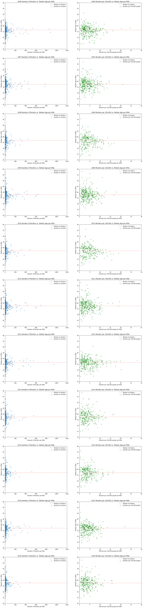


### 2.3 EDA with respect to Income


```python
afig, ax = plt.subplots(11, 2, figsize = (20, 90))
for k, v in df_dict.items():
    df = v
    income = [x for x in df.columns if 'Median income' in x][0]
    income_series = pd.to_numeric(df[income], errors='coerce')
    median = np.median(income_series.dropna().values)

    # Total number of murders vs Median income
    ax[k - 6][0].scatter(df['Murder_and_nonnegligent_manslaughter'], income_series, alpha=0.3, label='Number of murders')
    ax[k - 6][0].axhline(median, label='Median income', ls='--', alpha=0.5, color='r')
    ax[k - 6][0].set_yticks(range(14000, 40000, 5000))
    ax[k - 6][0].set_xlabel('Number of Murders per MSA')
    ax[k - 6][0].set_ylabel('Median Income in MSA')
    ax[k - 6][0].legend()
    ax[k - 6][0].set_title('{} Number of Murders vs. Median Income per MSA'.format(2000 + k))

    # Number of murders per 100,000 people vs Median income
    ax[k - 6][1].scatter(v['Murders_per_100000'], income_series, color='g', alpha=0.3, label='Murders per 100,000 people')
    ax[k - 6][1].axhline(median, color='r', ls='--', alpha=0.5, label='Median of medians')
    ax[k - 6][1].set_yticks(range(14000, 40000, 5000))
    ax[k - 6][1].set_xlabel('Murders per 100,000 people per MSA')
    ax[k - 6][1].set_ylabel('Median Income in MSA')
    ax[k - 6][1].legend()
    ax[k - 6][1].set_title('{} Murders per 100,000 vs. Median Income per MSA'.format(2000 + k))
```


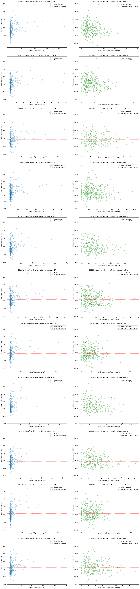


#### Insights re Median income

There are no real insights regarding the median income. There looks to be a slight negative correlation between median income and murder rate, which makes sense. However, there isn't much more detail. There should be more insights with respects the income distribution within the MSA.

### 2.4 EDA with respect to the poverty level in each MSA


```python
fig, ax = plt.subplots(11, 2, figsize = (20, 90))
for k, v in df_dict.items():
    df = v
    poverty_level = [x for x in df.columns if 'poverty level' in x][0]
    poverty_series = pd.to_numeric(df[poverty_level], errors='coerce')
    median = np.median(poverty_series.dropna().values)

    # Total number of murders vs Percentage of population living below poverty line
    ax[k - 6][0].scatter(df['Murder_and_nonnegligent_manslaughter'], poverty_series, alpha=0.3, label='Number of murders')
    ax[k - 6][0].axhline(median, label='Median poverty percentage', ls='--', alpha=0.5, color='r')
    ax[k - 6][0].set_yticks(range(0, 40, 5))
    ax[k - 6][0].set_xlabel('Number of Murders per MSA')
    ax[k - 6][0].set_ylabel('Percentage of People living in Poverty per MSA')
    ax[k - 6][0].legend()
    ax[k - 6][0].set_title('{} Number of Murders vs. Poverty Level per MSA'.format(2000 + k))

    # Number of murders per 100,000 vs Percentage of population living below poverty line
    ax[k - 6][1].scatter(v['Murders_per_100000'], poverty_series, color='g', alpha=0.3, label='Murders per 100,000 people')
    ax[k - 6][1].axhline(median, color='r', ls='--', alpha=0.5, label='Median poverty percentage')
    ax[k - 6][0].set_yticks(range(0, 40, 5))
    ax[k - 6][1].set_xlabel('Murders per 100,000 people per MSA')
    ax[k - 6][1].set_ylabel('Percentage of People living in Poverty per MSA')
    ax[k - 6][1].legend()
    ax[k - 6][1].set_title('{} Murders per 100,000 vs. Poverty Level per MSA'.format(2000 + k))
```


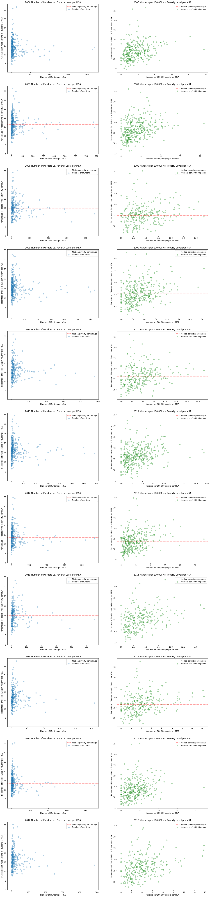


#### Insights re people living in poverty

Here the results are more interesting. There is a fairly clear positive correlation between people living below the poverty line and the murder rate (murders per 100,000). This also poses new questions. I'd be curious to investigate areas that have low murder rates but high level of poverty. This could give interesting insights into the causes of murder, as well as improvements we could make to our model. I am also strongly considering including the income breakdowns in the model, as well as the binary variable of living under the povery line. By extension, the poverty level will definitely be included in our model.

### 2.5 EDA with respect to Sex


```python
fig, ax = plt.subplots(11, 2, figsize = (20, 90))
for k, v in df_dict.items():
    df = v
    male = [x for x in df.columns if 'Male' in x][0]
    male_series = pd.to_numeric(df[male], errors='coerce')
    median = np.median(male_series.dropna().values)

    # Total number of murders vs. Percentage of population that is male
    ax[k - 6][0].scatter(df['Murder_and_nonnegligent_manslaughter'], male_series, alpha=0.3, label='Number of murders')
    ax[k - 6][0].axhline(median, label='Median percentage of population that is male', alpha=0.5, color='r', ls='--')
    ax[k - 6][0].set_ylim([46, 60])
    ax[k - 6][0].set_xlim([0, 1200])
    ax[k - 6][0].set_xlabel('Number of Murders per MSA')
    ax[k - 6][0].set_ylabel('Percentage of MSA Population that is Male')
    ax[k - 6][0].legend()
    ax[k - 6][0].set_title('{} Number of Murders vs. Male Population Percentage per MSA'.format(2000 + k))

    # Number of murders per 100,000 vs Percentage of population that is male
    ax[k - 6][1].scatter(v['Murders_per_100000'], male_series, color='g', alpha=0.3, label='Murders per 100,000 people')
    ax[k - 6][1].axhline(median, color='r', ls='--', alpha=0.5, label='Median percentage of population that is male')
    ax[k - 6][1].set_ylim([46, 60])
    ax[k - 6][1].set_xlim([0, 30])
    ax[k - 6][1].set_xlabel('Murders per 100,000 people per MSA')
    ax[k - 6][1].set_ylabel('Percentage of MSA Population that is Male')
    ax[k - 6][1].legend()
    ax[k - 6][1].set_title('{} Murders per 100,000 vs. Male Population Percentage per MSA'.format(2000 + k))
```


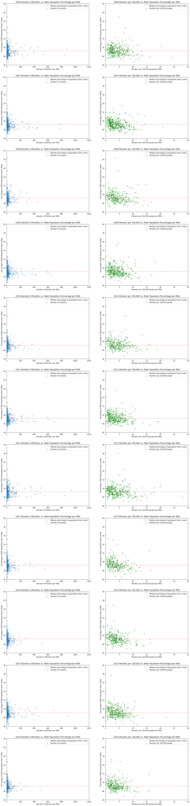


#### Insights re Sex distribution

There are no real insights regarding the gender distribution, given it hovers fairly close to 50%.

### 2.6 EDA with respect to Race


```python
fig, ax = plt.subplots(11, 2, figsize = (20, 90))
for k, v in df_dict.items():
    df = v
    races = [x for x in df.columns if 'RACE AND HISPANIC OR LATINO ORIGIN' in x]
    del races[0]
    for race in races[:-1]:
        label = race.split('-')[-1].strip()
        race_series = pd.to_numeric(df[race], errors='coerce').fillna(0)

        # Total number of murders vs. Racial Breakdown
        ax[k - 6][0].scatter(df['Murder_and_nonnegligent_manslaughter'], race_series, alpha=0.4, label=label)
        ax[k - 6][0].set_ylim([0, 100])
        ax[k - 6][0].set_xlim([0, 1200])

        # Murders per 100,000 vs. Racial Breakdown
        ax[k - 6][1].scatter(df['Murders_per_100000'], race_series, alpha=0.4, label=label)
        ax[k - 6][1].set_ylim([0, 100])
        ax[k - 6][1].set_xlim([0, 30])

    ax[k - 6][0].set_xlabel('Number of Murders per MSA')
    ax[k - 6][0].set_ylabel('Population Percentage'.format(label))
    ax[k - 6][0].legend()
    ax[k - 6][0].set_title('{} Number of Murders vs. Racial Breakdown per MSA'.format(2000 + k))

    ax[k - 6][1].set_xlabel('Number of Murders per MSA')
    ax[k - 6][1].set_ylabel('Population Percentage'.format(label))
    ax[k - 6][1].legend()
    ax[k - 6][1].set_title('{} Murders per 100,000 vs. Racial Breakdown per MSA'.format(2000 + k))
```


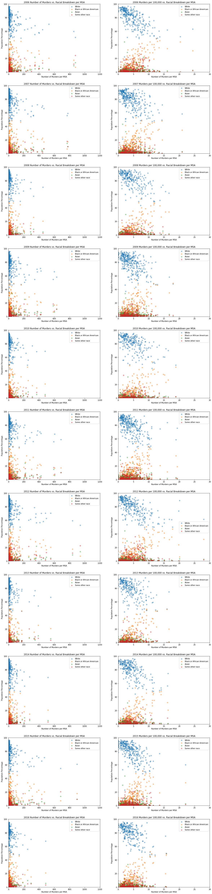


#### Insights re racial distribution

These graphics produce interesting but possibly misleading results. It is clear there is a positive correlation between the black/african american percentage of the population. By extension, there is a negative correlation between the white percentage of the population. However, correlation does not imply causation. Low income I suspect this population breakdown is closely correlated with # of people living below the poverty line. That being said, there may still be some additional insights that can be drawn (racial tensions, etc...), so I would likely include the racial breakdown of an MSA in the model.

### 2.7 EDA with respect to Ethnicity


```python
fig, ax = plt.subplots(11, 2, figsize = (20, 90))
for k, v in df_dict.items():
    df = v
    ethnicity = [x for x in df.columns if 'Hispanic or Latino' in x][0]
    ethnic_series = pd.to_numeric(df[ethnicity], errors='coerce').fillna(0)
    median = np.median(ethnic_series.values)

    # Total number of murders vs. Ethnic Breakdown
    ax[k - 6][0].scatter(df['Murder_and_nonnegligent_manslaughter'], ethnic_series, alpha=0.4, label='Number of Murders')
    ax[k - 6][0].axhline(median, label='Median Hispanic/Latino Population Percentage', ls='--', alpha=0.5, color='r')
    ax[k - 6][0].set_ylim([0, 100])
    ax[k - 6][0].set_xlim([0, 1200])
    ax[k - 6][0].set_xlabel('Number of Murders per MSA')
    ax[k - 6][0].set_ylabel('Hispanic/Latino Population Percentage'.format(label))
    ax[k - 6][0].legend()
    ax[k - 6][0].set_title('{} Number of Murders vs. Ethnic Breakdown per MSA'.format(2000 + k))

    # Murders per 100,000 vs. Ethnic Breakdown
    ax[k - 6][1].scatter(df['Murders_per_100000'], ethnic_series, alpha=0.4, label='Murders per 100,000 people', color='g')
    ax[k - 6][1].axhline(median, label='Median Hispanic/Latino Population Percentage', ls='--', alpha=0.5, color='r')
    ax[k - 6][1].set_ylim([0, 100])
    ax[k - 6][1].set_xlim([0, 30])
    ax[k - 6][1].set_xlabel('Number of Murders per MSA')
    ax[k - 6][1].set_ylabel('Hispanic/Latino Population Percentage'.format(label))
    ax[k - 6][1].legend()
    ax[k - 6][1].set_title('{} Murders per 100,000 vs. Ethnic Breakdown per MSA'.format(2000 + k))
```


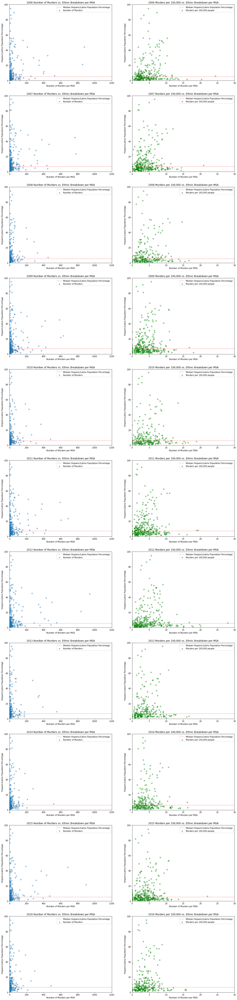


#### Insights re ethnic distribution

These graphics produce interesting but possibly misleading results as well. It is clear there is a positive correlation between the hispanic/lation percentage of the population and the murder rate. The correlation looks to be steeper than the trend observed in the previous visualizations. However, correlation does not imply causation. Low income I suspect this population breakdown is closely correlated with # of people living below the poverty line. That being said, there may still be some additional insights that can be drawn, so I would likely include the ethnic breakdown of an MSA in the model. I would also be curious to see if there are any other significant ethnic populations that lead to higher or lower murder rates (Jewish, etc...).

### 2.8 EDA with respect to educational attainment


```python
fig, ax = plt.subplots(11, 2, figsize = (20, 90))
for k, v in df_dict.items():
    df = v
    educations = [x for x in df.columns if 'EDUCATIONAL ATTAINMENT' in x]
    del educations[0]
    for i, education in enumerate(educations[:-2]):
        label = education.split('-')[-1].strip()
        ed_series = pd.to_numeric(df[education], errors='coerce').fillna(0)

        # Murders per 100,000 vs. Education Breakdown
        width = 0.5
        if i ==0:
            ax[k - 6][1].bar(df['Murders_per_100000'], ed_series, alpha=0.4, label=label, width=width)
        elif i == 1:
            prev_series = pd.to_numeric(df[educations[i - 1]], errors='coerce').fillna(0)
            ax[k - 6][1].bar(df['Murders_per_100000'], ed_series, bottom=prev_series, alpha=0.4, label=label, width=width)
        else:
            prev_series_1 = pd.to_numeric(df[educations[i - 1]], errors='coerce').fillna(0)
            prev_series_2 = pd.to_numeric(df[educations[i - 2]], errors='coerce').fillna(0)
            ax[k - 6][1].bar(df['Murders_per_100000'], ed_series, bottom=prev_series_1 + prev_series_2,
                      alpha=0.4, label=label, width=width)
        ax[k - 6][1].set_ylim([0, 100])
        ax[k - 6][1].set_xlim([0, 30])

    less_than_hs = pd.to_numeric(df[educations[0]], errors='coerce').fillna(0)
    median = np.median(less_than_hs)
    ax[k - 6][0].scatter(df['Murder_and_nonnegligent_manslaughter'],
                         less_than_hs, alpha=0.4, label='Number of murders')
    ax[k - 6][0].axhline(median, label='Median Percent of the Population with less than high school', ls='--', alpha=0.5, color='r')
    ax[k - 6][0].set_ylim([0, 100])
    ax[k - 6][0].set_xlim([0, 1200])
    ax[k - 6][0].set_xlabel('Number of Murders per MSA')
    ax[k - 6][0].set_ylabel('Population Percentage with less than a high school education'.format(label))
    ax[k - 6][0].legend()
    ax[k - 6][0].set_title('{} Number of Murders vs. Education Breakdown per MSA'.format(2000 + k))

    ax[k - 6][1].set_xlabel('Number of Murders per MSA')
    ax[k - 6][1].set_ylabel('Education Levels'.format(label))
    ax[k - 6][1].legend()
    ax[k - 6][1].set_title('{} Murders per 100,000 vs. Education Breakdown per MSA'.format(2000 + k))
```


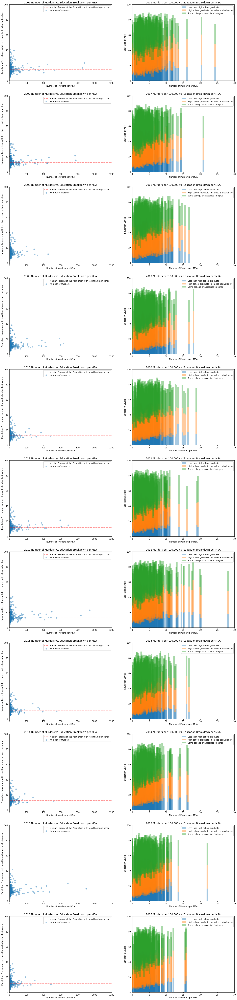


#### Insights re Education levels

I chose to use a different visualization technique to help with this EDA. The bar graph indicates some interesting results. Here, it is easier to see the negative correlation between level of education and the murder rate. The higher the proportion of population with less than high school graduations, the higher the murder rate. This is also true for the higher the rate of population with high school education, though it appears these trends counteract each other (when high school grad rates are high, the opposite rate is low, but there is still a higher murder count). Given this information, I would definitely include level of educational attainment in the model.

### 2.8 EDA with respect to Marital status


```python
fig, ax = plt.subplots(11, 2, figsize = (20, 90))
for k, v in df_dict.items():
    df = v
    marriage = [x for x in df.columns if 'MARITAL STATUS' in x]
    del marriage[0]
    for status in marriage:
        label = status.split('-')[-1].strip()
        marriage_series = pd.to_numeric(df[status], errors='coerce').fillna(0)

        # Total number of murders vs. Marriage Breakdown
        ax[k - 6][0].scatter(df['Murder_and_nonnegligent_manslaughter'], marriage_series, alpha=0.4, label=label)
        ax[k - 6][0].set_ylim([0, 100])
        ax[k - 6][0].set_xlim([0, 1200])

        # Murders per 100,000 vs. Marriage Breakdown
        ax[k - 6][1].scatter(df['Murders_per_100000'], marriage_series, alpha=0.4, label=label)
        ax[k - 6][1].set_ylim([0, 100])
        ax[k - 6][1].set_xlim([0, 30])

    ax[k - 6][0].set_xlabel('Number of Murders per MSA')
    ax[k - 6][0].set_ylabel('Population Percentage'.format(label))
    ax[k - 6][0].legend()
    ax[k - 6][0].set_title('{} Number of Murders vs. Marriage Breakdown per MSA'.format(2000 + k))

    ax[k - 6][1].set_xlabel('Number of Murders per MSA')
    ax[k - 6][1].set_ylabel('Population Percentage'.format(label))
    ax[k - 6][1].legend()
    ax[k - 6][1].set_title('{} Murders per 100,000 vs. Marriage Breakdown per MSA'.format(2000 + k))
```


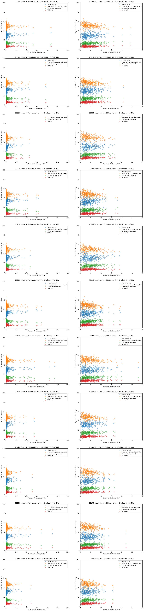


#### Insights re Marital status

I really wish there had been a higher correlation with this one, but it doesn't look as though we can draw any insights. Perhaps a very slight positive correlation with single/separated and a very slight negative correlation with married. Currently a toss up as to whether I include this in the model or not. I would have to run some more tests.

### 2.9 EDA with respect to U.S. Citizen Population %


```python
fig, ax = plt.subplots(11, 2, figsize = (20, 90))
for k, v in df_dict.items():
    df = v
    citizen = [x for x in df.columns if 'Citizenship' in x][0]
    citizen_series = pd.to_numeric(df[citizen], errors='coerce').fillna(0)
    median = np.median(citizen_series.values)

    # Total number of murders vs. Percentage of US citizens
    ax[k - 6][0].scatter(df['Murder_and_nonnegligent_manslaughter'], citizen_series, alpha=0.3, label='Number of murders')
    ax[k - 6][0].axhline(median, label='Median percentage of population that has US citizenship', alpha=0.5, color='r', ls='--')
    ax[k - 6][0].set_xlabel('Number of Murders per MSA')
    ax[k - 6][0].set_ylabel('Percentage of MSA Percentage of U.S. Citizenship %')
    ax[k - 6][0].legend()
    ax[k - 6][0].set_title('{} Number of Murders vs. Citizenship Percentage per MSA'.format(2000 + k))

    # Number of murders per 100,000 vs P Percentage of US citizens
    ax[k - 6][1].scatter(v['Murders_per_100000'], citizen_series, color='g', alpha=0.3, label='Murders per 100,000 people')
    ax[k - 6][1].axhline(median, color='r', ls='--', alpha=0.5, label='Median percentage of population that has US citizenship')
    ax[k - 6][1].set_xlabel('Murders per 100,000 people per MSA')
    ax[k - 6][1].set_ylabel('Percentage of MSA Percentage of U.S. Citizenship %')
    ax[k - 6][1].legend()
    ax[k - 6][1].set_title('{} Murders per 100,000 vs. Citizenship Percentage per MSA'.format(2000 + k))
```


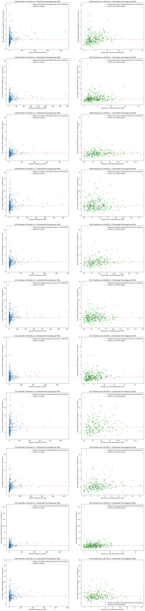


### 2.10 EDA with respect to Foreign Born Population %


```python
fig, ax = plt.subplots(11, 2, figsize = (20, 90))
for k, v in df_dict.items():
    df = v
    non_native_series = pd.to_numeric(df['non_native'], errors='coerce').fillna(0)
    pop_series = pd.to_numeric(df['Total; Estimate; Total population'], errors='coerce').fillna(1)

    foreign_series = non_native_series / pop_series
    median = np.median(foreign_series.values)

    # Total number of murders vs. Percentage of foreign population (born outside US)
    ax[k - 6][0].scatter(df['Murder_and_nonnegligent_manslaughter'], foreign_series, alpha=0.3, label='Number of murders')
    ax[k - 6][0].axhline(median, label='Median percentage of population that is foreign born', alpha=0.5, color='r', ls='--')
    ax[k - 6][0].set_ylim([0, 0.1])
    ax[k - 6][0].set_xlim([0, 1200])
    ax[k - 6][0].set_xlabel('Number of Murders per MSA')
    ax[k - 6][0].set_ylabel('Percentage of MSA Population that is foreign born')
    ax[k - 6][0].legend()
    ax[k - 6][0].set_title('{} Number of Murders vs. Foreign Population Percentage per MSA'.format(2000 + k))

    # Number of murders per 100,000 vs P Percentage of foreign population (born outside US)
    ax[k - 6][1].scatter(v['Murders_per_100000'], foreign_series, color='g', alpha=0.3, label='Murders per 100,000 people')
    ax[k - 6][1].axhline(median, color='r', ls='--', alpha=0.5, label='Median percentage of population that is foreign born')
    ax[k - 6][1].set_ylim([0, 0.1])
    ax[k - 6][1].set_xlim([0, 30])
    ax[k - 6][1].set_xlabel('Murders per 100,000 people per MSA')
    ax[k - 6][1].set_ylabel('Percentage of MSA Population that is foreign born')
    ax[k - 6][1].legend()
    ax[k - 6][1].set_title('{} Murders per 100,000 vs. Foreign Population Percentage per MSA'.format(2000 + k))
```


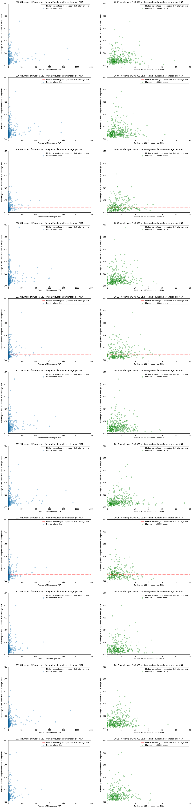


### 2.11 Examine Correlation Matrix of these Variables

We wanted to see the overall correlation matrix for between all of the selected independent and dependent variables, and we deemed a correlation heatmap would be appropriate.


```python
[x for x in df_dict[6].columns if 'non_' in x][0]
```


    'non_native'


```python
frames = []
for k, v in df_dict.items():
    male = [x for x in v.columns if 'Male' in x][0]
    median_age = [x for x in v.columns if 'Median age' in x][0]
    median_income = [x for x in v.columns if 'Median income' in x][-1]
    black = [x for x in v.columns if 'Black or' in x][0]
    white = [x for x in v.columns if 'White' in x][0]
    poverty = [x for x in v.columns if 'poverty' in x][1]
    uneducated = [x for x in v.columns if 'EDUCATIONAL ATTAINMENT' in x][1]
    highschool = [x for x in v.columns if 'EDUCATIONAL ATTAINMENT' in x][2]
    college = [x for x in v.columns if 'EDUCATIONAL ATTAINMENT' in x][3:5]
    citizen = [x for x in v.columns if 'Citizenship' in x][0]
    v["Year"] = 2000 + k
    non_native_series = pd.to_numeric(v['non_native'], errors='coerce').fillna(0)
    pop_series = pd.to_numeric(v['Total; Estimate; Total population'], errors='coerce').fillna(1)
    cols = ['Murder_and_nonnegligent_manslaughter', 'Murders_per_100000', 'Year', poverty, male,
            median_age, median_income, black, white, uneducated, highschool, citizen]
    df_temp = v[cols]
    df_temp.columns = ['murder_count', 'muder_per_100000', 'year', 'poverty', 'male','median_age',
                       'median_income', 'black', 'white', 'uneducated', 'highschool', 'citizen']
    df_temp['college'] = v[college].sum(axis=1)
    df_temp['foreign'] = foreign_series
    frames.append(df_temp)
df_concat = pd.concat(frames)
```


    /Users/kazuma/anaconda/envs/py36/lib/python3.6/site-packages/ipykernel/__main__.py:21: SettingWithCopyWarning:
    A value is trying to be set on a copy of a slice from a DataFrame.
    Try using .loc[row_indexer,col_indexer] = value instead

    See the caveats in the documentation: http://pandas.pydata.org/pandas-docs/stable/indexing.html#indexing-view-versus-copy
    /Users/kazuma/anaconda/envs/py36/lib/python3.6/site-packages/ipykernel/__main__.py:22: SettingWithCopyWarning:
    A value is trying to be set on a copy of a slice from a DataFrame.
    Try using .loc[row_indexer,col_indexer] = value instead

    See the caveats in the documentation: http://pandas.pydata.org/pandas-docs/stable/indexing.html#indexing-view-versus-copy


```python
for i in df_concat.columns:
    df_concat[i] = pd.to_numeric(df_concat[i], errors='coerce').fillna(0)
```


```python
fig, ax = plt.subplots(1, 1, figsize = (10, 8))
corr = df_concat.corr()
sns.heatmap(corr)
```


    <matplotlib.axes._subplots.AxesSubplot at 0x11ffa68d0>


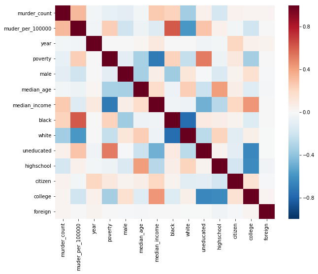


### 2.12 Additional Questions

Are there any other variables we can investigate? Perhaps government expenditures in certain areas, police presence, political breakdowns. I am definitely interested in looking into more datasets if possible. Level of poverty looks fairly strongly correlated with the murder rate, what of the MSA's with high poverty but low murder?
