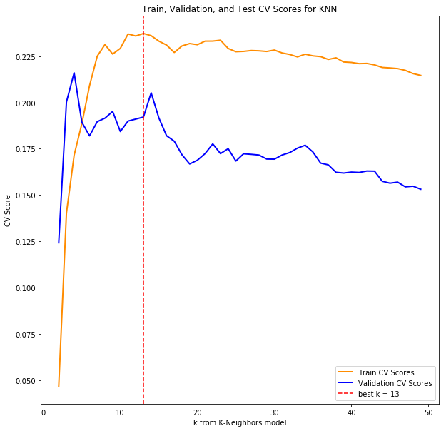
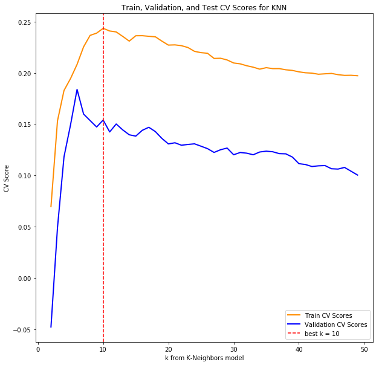
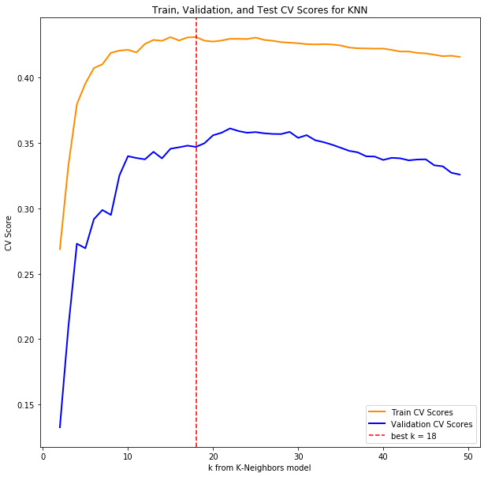
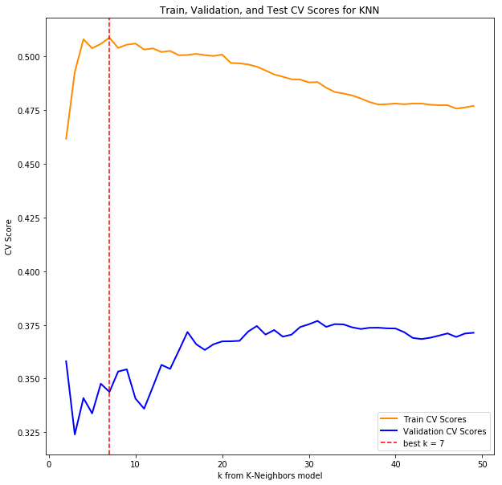
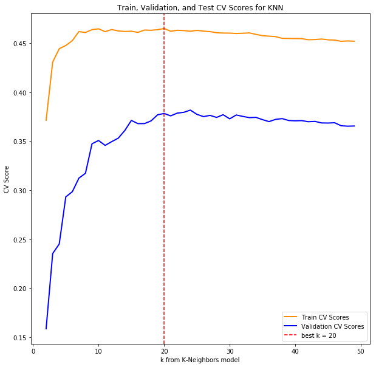
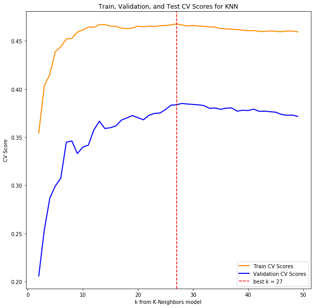

## Contents
{:.no_toc}
*  
{: toc}


```python
#Import libraries
import numpy as np
import pandas as pd
import matplotlib
import matplotlib.pyplot as plt
import statsmodels.api as sm
from statsmodels.api import OLS
from sklearn.metrics import r2_score
from sklearn.preprocessing import PolynomialFeatures
from sklearn.linear_model import Ridge
from sklearn.linear_model import Lasso
from sklearn.linear_model import RidgeCV
from sklearn.linear_model import LassoCV
from sklearn.linear_model import LinearRegression
from sklearn.model_selection import train_test_split
from sklearn.preprocessing import MinMaxScaler
from sklearn.model_selection import cross_val_score
from sklearn.neighbors import KNeighborsRegressor
from sklearn.preprocessing import Imputer
from os import listdir
from os.path import isfile, join
%matplotlib inline
```


    /Users/kazuma/anaconda/envs/py36/lib/python3.6/site-packages/statsmodels/compat/pandas.py:56: FutureWarning: The pandas.core.datetools module is deprecated and will be removed in a future version. Please use the pandas.tseries module instead.
      from pandas.core import datetools


## 3 Basic Prediction Model

### 3.1 Load Dataframes and cursory cleaning


```python
census_data_path = 'Crime/data/census/'
```


```python
census_folder_fps = [f for f in listdir(census_data_path) if isfile(join(census_data_path, f))]
```


```python
csv_filepaths = [f for f in listdir('csvs/') if isfile(join('csvs/', f))]
```


```python
census_filepaths = [f for f in census_folder_fps if f[3:] == 'census.csv']
```


```python
def strip_dashes(x):
    return ' '.join(' '.join(x.split('-')).split())
```


```python
def merge_df_msa(fbi_df, census_df):
    census_mask = census_df['Geography'].isnull()
    fbi_mask = fbi_df['Metropolitan_Statistical_Area'].isnull()

    df_c = census_df[~census_mask]
    df_f = fbi_df[~fbi_mask]

    geos = df_c['Geography'].apply(lambda x: x.split('Metro Area')[0].strip())
    geos = geos.apply(strip_dashes)
    df_c['Geography'] = geos

    fbi_geos = df_f['Metropolitan_Statistical_Area'].apply(strip_dashes)
    df_f['Metropolitan_Statistical_Area'] = fbi_geos

    return pd.merge(df_f, df_c, left_on='Metropolitan_Statistical_Area', right_on='Geography', how='inner').drop('Geography', axis=1)

```


```python
df_dict = dict()
for i in range(0, 11):
    df_fbi = pd.read_csv(join('csvs/', csv_filepaths[i]))
    df_census = pd.read_csv(join(census_data_path, census_filepaths[i]), skiprows=1).drop(['Id', 'Id2'], axis=1)
    columns = [col for col in df_census.columns if 'Native' not in col and 'Margin of Error' not in col]
    foreign = [x for x in df_census.columns if 'born outside' in x][0]
    non_native = df_census[foreign]

    df_census = df_census[columns]
    df_census['non_native'] = non_native

    df = merge_df_msa(df_fbi, df_census)

    # Compute murders per 100,000 people
    population = [x for x in df.columns if 'Total population' in x][0]
    per_100 = pd.to_numeric(df[population], errors='coerce')/100000.0
    df['Murders_per_100000'] = df['Murder_and_nonnegligent_manslaughter']/per_100
    df['population'] = df[population]

    # Drop any columns that don't have murder counts
    df = df.dropna(subset=['Murders_per_100000'])

    df_dict[i + 6] = df
```


    /Users/kazuma/anaconda/envs/py36/lib/python3.6/site-packages/ipykernel/__main__.py:14: SettingWithCopyWarning:
    A value is trying to be set on a copy of a slice from a DataFrame.
    Try using .loc[row_indexer,col_indexer] = value instead

    See the caveats in the documentation: http://pandas.pydata.org/pandas-docs/stable/indexing.html#indexing-view-versus-copy


```python
frames = []
for k, v in df_dict.items():

    # Various labels we decided would be relevant, basic demographic
    male = [x for x in v.columns if 'Male' in x][0]
    median_age = [x for x in v.columns if 'Median age' in x][0]
    median_income = [x for x in v.columns if 'Median income' in x][-1]
    black = [x for x in v.columns if 'Black or' in x][0]
    white = [x for x in v.columns if 'White' in x][0]
    hispanic = [x for x in v.columns if 'Hispanic' in x][0]
    poverty = [x for x in v.columns if 'poverty' in x][1]

    # Income Labels
    income_levels = [x for x in v.columns if 'Population 15 years and over - $' in x]
    income_labels = [x.split("- ")[-1] for x in v.columns if 'Population 15 years and over - $' in x]
    for i, level in enumerate(income_levels):
        v[income_labels[i]] = v[income_levels[i]]

    # Education Levels
    uneducated = [x for x in v.columns if 'EDUCATIONAL ATTAINMENT' in x][1]
    highschool = [x for x in v.columns if 'EDUCATIONAL ATTAINMENT' in x][2]
    college = [x for x in v.columns if 'EDUCATIONAL ATTAINMENT' in x][3:5]

    v["Year"] = 2000 + k
    non_native_series = pd.to_numeric(v['non_native'], errors='coerce').fillna(0)
    pop_series = pd.to_numeric(v['Total; Estimate; Total population'], errors='coerce').fillna(1)
    cols = ['Murder_and_nonnegligent_manslaughter', 'Murders_per_100000', 'Year', poverty, male,
            median_age, median_income, black, white, hispanic, uneducated, highschool] + income_levels
    df_temp = v[cols]
    column_labels = ['murder_count', 'murder_per_100000', 'year', 'poverty', 'male','median_age',
                       'median_income', 'black', 'white', 'hispanic', 'uneducated', 'highschool'] + income_labels

    # Percentage of population that are young adults, could include or not!
    ya_tier = [x for x in v.columns if 'AGE' in x][:8][2]
    ya_series = pd.to_numeric(v[ya_tier], errors='coerce').fillna(0)
    ya_percentage = ya_series/pop_series

    df_temp.columns = column_labels
    df_temp['college'] = v[college].sum(axis=1)
    df_temp['foreign'] = non_native_series / pop_series
    df_temp['population'] = v['population']
    frames.append(df_temp)
df_concat = pd.concat(frames)
```


    /Users/kazuma/anaconda/envs/py36/lib/python3.6/site-packages/ipykernel/__main__.py:40: SettingWithCopyWarning:
    A value is trying to be set on a copy of a slice from a DataFrame.
    Try using .loc[row_indexer,col_indexer] = value instead

    See the caveats in the documentation: http://pandas.pydata.org/pandas-docs/stable/indexing.html#indexing-view-versus-copy
    /Users/kazuma/anaconda/envs/py36/lib/python3.6/site-packages/ipykernel/__main__.py:41: SettingWithCopyWarning:
    A value is trying to be set on a copy of a slice from a DataFrame.
    Try using .loc[row_indexer,col_indexer] = value instead

    See the caveats in the documentation: http://pandas.pydata.org/pandas-docs/stable/indexing.html#indexing-view-versus-copy
    /Users/kazuma/anaconda/envs/py36/lib/python3.6/site-packages/ipykernel/__main__.py:42: SettingWithCopyWarning:
    A value is trying to be set on a copy of a slice from a DataFrame.
    Try using .loc[row_indexer,col_indexer] = value instead

    See the caveats in the documentation: http://pandas.pydata.org/pandas-docs/stable/indexing.html#indexing-view-versus-copy


```python
y = df_concat['murder_per_100000']
X = df_concat.drop(['murder_per_100000', 'murder_count'], axis=1)
X = X.apply(pd.to_numeric, errors='coerce')
X_train, X_test, y_train, y_test = train_test_split(X, y, test_size=0.2, random_state=42)
```


### 3.2 Linear Ridge, Lasso, KNN regression CV on basic columns (sex, income, etc...)

#### 3.2.1 Set up training and validation datasets


```python
X_tr, X_val, y_tr, y_val = train_test_split(X_train, y_train, test_size=0.2, random_state=42)
```


```python
def train_and_validate(X_tr, X_val, y_tr, y_val, cols, title, add_const=True, poly=False, include_knn=True):
    X_col_tr = X_tr[cols].apply(pd.to_numeric, errors='coerce').values
    X_col_val = X_val[cols].apply(pd.to_numeric, errors='coerce').values
    imputer = Imputer(strategy='mean')

    # Fill nan values with means
    X_col_tr = imputer.fit_transform(X_col_tr)
    X_col_val = imputer.fit_transform(X_col_val)

    # Scale everything
    scaler = MinMaxScaler()
    if poly:
        poly_generator = PolynomialFeatures(4, include_bias=False)
        if add_const:
            X_col_tr = poly_generator.fit_transform(scaler.fit_transform(X_col_tr))
            X_col_val = poly_generator.fit_transform(scaler.fit_transform(X_col_val))
        else:
            X_col_tr = sm.add_constant(poly_generator.fit_transform(scaler.fit_transform(X_tr_col)))
            X_col_val = sm.add_constant(poly_generator.fit_transform(scaler.fit_transform(X_val_col)))
    else:
        if add_const:
            X_col_tr = sm.add_constant(scaler.fit_transform(X_col_tr))
            X_col_val = sm.add_constant(scaler.fit_transform(X_col_val))
        else:
            X_col_tr = scaler.fit_transform(X_col_tr)
            X_col_val = scaler.fit_transform(X_col_val)


    # Linear Regression
    lr = LinearRegression()
    lr.fit(X_col_tr, y_tr)
    print('Training R^2 for {} Linear Regression: {}'.format(title, lr.score(X_col_tr, y_tr)))
    print('Validation R^2 for {} Linear Regression: {}'.format(title, lr.score(X_col_val, y_val)))
    print()

    # Lasso Regression
    lasso = LassoCV(cv=5)
    lasso.fit(X_col_tr, y_tr)
    print('Training R^2 for {} Lasso Regression: {}'.format(title, lasso.score(X_col_tr, y_tr)))
    print('Validation R^2 for {} Lasso Regression: {}'.format(title, lasso.score(X_col_val, y_val)))
    print()

    # Ridge Regression
    ridge = RidgeCV(cv=5)
    ridge.fit(X_col_tr, y_tr)
    print('Training R^2 for {} Ridge Regression: {}'.format(title, ridge.score(X_col_tr, y_tr)))
    print('Validation R^2 for {} Ridge Regression: {}'.format(title, ridge.score(X_col_val, y_val)))
    print()

    # KNN, with max_neighbors found through CV
    if include_knn:
        ks = list(range(2, 50))
        scores = []
        scores_val = []
        max_score = 0
        max_k = 0
        for k in ks:
            knn = KNeighborsRegressor(n_neighbors = k)
            score = cross_val_score(knn, X_col_tr, y_tr).mean()
            scores.append(score)
            scores_val.append(cross_val_score(knn, X_col_val, y_val).mean())
            if score > max_score:
                max_k = k
                max_score = score
        knn = KNeighborsRegressor(n_neighbors = max_k)
        knn.fit(X_col_tr, y_tr)
        print("Training Score for KNN (k={}) Model: {}".format(max_k, knn.score(X_col_tr, y_tr)))
        print("Validation Score for KNN (k={}) Model: {}".format(max_k, knn.score(X_col_val, y_val)))

        plt.figure(figsize=(10,10))
        plt.plot(ks, scores, color='darkorange', lw=2, label='Train CV Scores')
        plt.plot(ks, scores_val, color='blue', lw=2, label='Validation CV Scores')
        plt.axvline(x=max_k, color='red', label='best k = {}'.format(max_k), linestyle='--')
        plt.xlabel('k from K-Neighbors model')
        plt.ylabel('CV Score')
        plt.title('Train, Validation, and Test CV Scores for KNN')
        plt.legend(loc="lower right")
    else:
        knn=False

    return [lr, lasso, ridge, knn]
```


```python
basic_cols = ['median_age', 'median_income', 'male', 'poverty', 'population']
basic_models = train_and_validate(X_tr, X_val, y_tr, y_val, basic_cols, "Basic", add_const=True, poly=False)
```


    Training R^2 for Basic Linear Regression: 0.10336462166830496
    Validation R^2 for Basic Linear Regression: 0.0905740112706801

    Training R^2 for Basic Lasso Regression: 0.10196365776150063
    Validation R^2 for Basic Lasso Regression: 0.08412300206289403

    Training R^2 for Basic Ridge Regression: 0.1031256353613198
    Validation R^2 for Basic Ridge Regression: 0.09070882715172046

    Training Score for KNN (k=13) Model: 0.384829110871148
    Validation Score for KNN (k=13) Model: 0.02369172929875007





### 3.3 Include more comprehensive income levels in each model


```python
income_cols = basic_cols + ['$1 to $9,999 or loss', '$10,000 to $14,999', '$15,000 to $24,999',
               '$25,000 to $34,999', '$35,000 to $49,999', '$50,000 to $64,999',
               '$65,000 to $74,999', '$75,000 or more']
comp_income_models = train_and_validate(X_tr, X_val, y_tr, y_val, income_cols, "Income", add_const=True, poly=False)
```


    Training R^2 for Income Linear Regression: 0.14258477634600875
    Validation R^2 for Income Linear Regression: 0.1448900418121657

    Training R^2 for Income Lasso Regression: 0.1418296759572274
    Validation R^2 for Income Lasso Regression: 0.14534604419731512

    Training R^2 for Income Ridge Regression: 0.14155031635922333
    Validation R^2 for Income Ridge Regression: 0.14566808055357683

    Training Score for KNN (k=10) Model: 0.39124066387943257
    Validation Score for KNN (k=10) Model: 0.1320391142119982





Currently it looks as though Ridge Regression performs the best out of the the basic linear regression models

### 3.4 Include all columns in each model


```python
all_col_models = train_and_validate(X_tr, X_val, y_tr, y_val, X_tr.columns, "All Columns", add_const=True, poly=False)
```


    Training R^2 for All Columns Linear Regression: 0.4462319942491597
    Validation R^2 for All Columns Linear Regression: 0.4108502357189554

    Training R^2 for All Columns Lasso Regression: 0.44560209039581394
    Validation R^2 for All Columns Lasso Regression: 0.4102549436785793

    Training R^2 for All Columns Ridge Regression: 0.4458059433121516
    Validation R^2 for All Columns Ridge Regression: 0.41016795215679747

    Training Score for KNN (k=18) Model: 0.5069220726159709
    Validation Score for KNN (k=18) Model: 0.44440789682622034





### 3.5 OLS Model to determine statistically significant predictors

#### 3.5.1 OLS Model


```python
X_all_train = X_tr.apply(pd.to_numeric, errors='coerce')
X_all_val = X_val.apply(pd.to_numeric, errors='coerce')

imputer = Imputer(strategy='mean')

X_const_train = imputer.fit_transform(X_all_train)
X_const_val = imputer.fit_transform(X_all_val)

scaler = MinMaxScaler()
X_const_train = sm.add_constant(scaler.fit_transform(X_const_train))
X_const_val = sm.add_constant(scaler.fit_transform(X_const_val))

model = OLS(endog=y_tr, exog=X_const_train)
result = model.fit()

y_hat_train = result.predict()
y_hat_val = result.predict(exog=X_const_val)

print('Train R^2 =', r2_score(y_tr, y_hat_train))
print('Validation R^2 =', r2_score(y_val, y_hat_val))
```


    Train R^2 = 0.446231994249
    Validation R^2 = 0.410850235719


```python
xlabs = ['const'] + list(X_train.columns)
result.summary(xname=xlabs)
```


<table class="simpletable">
<caption>OLS Regression Results</caption>
<tr>
  <th>Dep. Variable:</th>    <td>murder_per_100000</td> <th>  R-squared:         </th> <td>   0.446</td>
</tr>
<tr>
  <th>Model:</th>                   <td>OLS</td>        <th>  Adj. R-squared:    </th> <td>   0.441</td>
</tr>
<tr>
  <th>Method:</th>             <td>Least Squares</td>   <th>  F-statistic:       </th> <td>   79.70</td>
</tr>
<tr>
  <th>Date:</th>             <td>Wed, 06 Dec 2017</td>  <th>  Prob (F-statistic):</th> <td>5.55e-248</td>
</tr>
<tr>
  <th>Time:</th>                 <td>20:15:43</td>      <th>  Log-Likelihood:    </th> <td> -4719.9</td>
</tr>
<tr>
  <th>No. Observations:</th>      <td>  2099</td>       <th>  AIC:               </th> <td>   9484.</td>
</tr>
<tr>
  <th>Df Residuals:</th>          <td>  2077</td>       <th>  BIC:               </th> <td>   9608.</td>
</tr>
<tr>
  <th>Df Model:</th>              <td>    21</td>       <th>                     </th>     <td> </td>    
</tr>
<tr>
  <th>Covariance Type:</th>      <td>nonrobust</td>     <th>                     </th>     <td> </td>    
</tr>
</table>
<table class="simpletable">
<tr>
            <td></td>              <th>coef</th>     <th>std err</th>      <th>t</th>      <th>P>|t|</th>  <th>[0.025</th>    <th>0.975]</th>  
</tr>
<tr>
  <th>const</th>                <td>    5.7329</td> <td>    1.957</td> <td>    2.930</td> <td> 0.003</td> <td>    1.896</td> <td>    9.570</td>
</tr>
<tr>
  <th>$1 to $9,999 or loss</th> <td>    0.7105</td> <td>    0.793</td> <td>    0.896</td> <td> 0.370</td> <td>   -0.845</td> <td>    2.266</td>
</tr>
<tr>
  <th>$10,000 to $14,999</th>   <td>    0.5470</td> <td>    0.596</td> <td>    0.917</td> <td> 0.359</td> <td>   -0.622</td> <td>    1.716</td>
</tr>
<tr>
  <th>$15,000 to $24,999</th>   <td>   -0.5599</td> <td>    0.906</td> <td>   -0.618</td> <td> 0.537</td> <td>   -2.337</td> <td>    1.217</td>
</tr>
<tr>
  <th>$25,000 to $34,999</th>   <td>    1.1013</td> <td>    0.616</td> <td>    1.787</td> <td> 0.074</td> <td>   -0.108</td> <td>    2.310</td>
</tr>
<tr>
  <th>$35,000 to $49,999</th>   <td>    0.5251</td> <td>    0.673</td> <td>    0.780</td> <td> 0.435</td> <td>   -0.794</td> <td>    1.845</td>
</tr>
<tr>
  <th>$50,000 to $64,999</th>   <td>   -0.9803</td> <td>    0.726</td> <td>   -1.350</td> <td> 0.177</td> <td>   -2.404</td> <td>    0.444</td>
</tr>
<tr>
  <th>$65,000 to $74,999</th>   <td>    1.1605</td> <td>    0.642</td> <td>    1.809</td> <td> 0.071</td> <td>   -0.098</td> <td>    2.419</td>
</tr>
<tr>
  <th>$75,000 or more</th>      <td>    1.6142</td> <td>    1.042</td> <td>    1.549</td> <td> 0.122</td> <td>   -0.430</td> <td>    3.658</td>
</tr>
<tr>
  <th>black</th>                <td>    3.7697</td> <td>    0.489</td> <td>    7.710</td> <td> 0.000</td> <td>    2.811</td> <td>    4.729</td>
</tr>
<tr>
  <th>college</th>              <td>    1.6800</td> <td>    0.868</td> <td>    1.936</td> <td> 0.053</td> <td>   -0.022</td> <td>    3.382</td>
</tr>
<tr>
  <th>foreign</th>              <td>   -1.7076</td> <td>    0.472</td> <td>   -3.616</td> <td> 0.000</td> <td>   -2.634</td> <td>   -0.782</td>
</tr>
<tr>
  <th>highschool</th>           <td>    3.2544</td> <td>    0.784</td> <td>    4.153</td> <td> 0.000</td> <td>    1.718</td> <td>    4.791</td>
</tr>
<tr>
  <th>hispanic</th>             <td>    0.8060</td> <td>    0.597</td> <td>    1.349</td> <td> 0.177</td> <td>   -0.365</td> <td>    1.977</td>
</tr>
<tr>
  <th>male</th>                 <td>   -0.6007</td> <td>    0.672</td> <td>   -0.893</td> <td> 0.372</td> <td>   -1.919</td> <td>    0.718</td>
</tr>
<tr>
  <th>median_age</th>           <td>    1.7845</td> <td>    0.705</td> <td>    2.532</td> <td> 0.011</td> <td>    0.402</td> <td>    3.167</td>
</tr>
<tr>
  <th>median_income</th>        <td>   -1.8899</td> <td>    1.171</td> <td>   -1.614</td> <td> 0.107</td> <td>   -4.187</td> <td>    0.407</td>
</tr>
<tr>
  <th>population</th>           <td>    1.7170</td> <td>    0.820</td> <td>    2.094</td> <td> 0.036</td> <td>    0.109</td> <td>    3.325</td>
</tr>
<tr>
  <th>poverty</th>              <td>    0.0808</td> <td>    0.700</td> <td>    0.115</td> <td> 0.908</td> <td>   -1.293</td> <td>    1.454</td>
</tr>
<tr>
  <th>uneducated</th>           <td>    3.2330</td> <td>    0.912</td> <td>    3.544</td> <td> 0.000</td> <td>    1.444</td> <td>    5.022</td>
</tr>
<tr>
  <th>white</th>                <td>   -8.7646</td> <td>    0.625</td> <td>  -14.016</td> <td> 0.000</td> <td>   -9.991</td> <td>   -7.538</td>
</tr>
<tr>
  <th>year</th>                 <td>   -0.1063</td> <td>    0.166</td> <td>   -0.641</td> <td> 0.521</td> <td>   -0.431</td> <td>    0.219</td>
</tr>
</table>
<table class="simpletable">
<tr>
  <th>Omnibus:</th>       <td>521.600</td> <th>  Durbin-Watson:     </th> <td>   2.058</td>
</tr>
<tr>
  <th>Prob(Omnibus):</th> <td> 0.000</td>  <th>  Jarque-Bera (JB):  </th> <td>2342.335</td>
</tr>
<tr>
  <th>Skew:</th>          <td> 1.121</td>  <th>  Prob(JB):          </th> <td>    0.00</td>
</tr>
<tr>
  <th>Kurtosis:</th>      <td> 7.665</td>  <th>  Cond. No.          </th> <td>    102.</td>
</tr>
</table>


```python
print("Significant predictors at alpha = 0.05:", list(np.array(xlabs)[np.array(result.pvalues < 0.05)]), 'with p-values of:', list(result.pvalues[np.array(result.pvalues < 0.05)]))
```


    Significant predictors at alpha = 0.05: ['const', 'black', 'foreign', 'highschool', 'median_age', 'population', 'uneducated', 'white'] with p-values of: [0.0034255754667554413, 1.9406727072854948e-14, 0.00030586819343893327, 3.4184670079430795e-05, 0.011409139649156946, 0.036380755382960761, 0.00040328399497637418, 1.0271980794482728e-42]


```python
most_significant = np.array(xlabs)[np.array(result.pvalues < 0.05)][1:]
```


#### 3.5.2 Train models on most significant predictors determined by OLS


```python
OLS_sig_col_models = train_and_validate(X_tr, X_val, y_tr, y_val, most_significant, "Most Significant OLS Predictors", add_const=True, poly=False)
```


    Training R^2 for Most Significant OLS Predictors Linear Regression: 0.4403589258248584
    Validation R^2 for Most Significant OLS Predictors Linear Regression: 0.40655554960022205

    Training R^2 for Most Significant OLS Predictors Lasso Regression: 0.4403526474899125
    Validation R^2 for Most Significant OLS Predictors Lasso Regression: 0.40658558175226805

    Training R^2 for Most Significant OLS Predictors Ridge Regression: 0.4402215161510081
    Validation R^2 for Most Significant OLS Predictors Ridge Regression: 0.406473259967734

    Training Score for KNN (k=7) Model: 0.6573569971226408
    Validation Score for KNN (k=7) Model: 0.4990922977081862





### 3.6 Subset Selection


```python
def step_forwards_backwards(df, y_vars, direction='forward'):
    assert direction in ['forward', 'backward']
    y = y_vars.reshape(-1,1)
    predictors = set(df.columns)
    selected_predictors = set() if direction=='forward' else set(predictors)
    n = df.shape[0]
    best_bic = np.inf
    best_bics = []
    best_models = []

    imputer = Imputer(strategy='mean')

    if direction == 'forward':
        X = np.ones(n).reshape(-1,1)
        X = np.concatenate([X, df[list(selected_predictors)].values], axis=1)
        while (True):
            possible_bic_scores = []
            possible_predictors = list(selected_predictors ^ predictors)
            if len(possible_predictors) == 0:
                break
            for predictor in possible_predictors:
                x_temp = np.concatenate([X, df[predictor].values.reshape(-1,1)], axis=1)
                x_temp = imputer.fit_transform(x_temp)

                model = OLS(endog=y, exog=x_temp).fit()
                bic = model.bic
                possible_bic_scores.append(bic)
            best_predictor_ix = np.argmin(possible_bic_scores)
            best_predictor = possible_predictors[best_predictor_ix]
            best_bic = np.min(possible_bic_scores)
            best_bics.append(best_bic)
            selected_predictors.add(best_predictor)            
            X = np.concatenate([X, df[best_predictor].values.reshape(-1,1)], axis=1)
            best_models.append(list(selected_predictors))
    else:
        while (True):
            possible_bic_scores = []
            possible_predictors = list(selected_predictors)
            if len(possible_predictors) == 0:
                break
            for predictor in possible_predictors:
                X = np.concatenate([np.ones(n).reshape(-1,1), df[list(selected_predictors - set([predictor]))].values], axis=1)
                X = imputer.fit_transform(X)

                model = OLS(endog=y, exog=X).fit()
                bic = model.bic
                possible_bic_scores.append(bic)
            best_predictor_ix = np.argmin(possible_bic_scores)
            best_predictor = possible_predictors[best_predictor_ix]
            best_bic = possible_bic_scores[best_predictor_ix]
            selected_predictors.discard(best_predictor)
            best_bics.append(best_bic)
            best_models.append(list(selected_predictors))
    index_of_best_bic = np.argmin(best_bics)
    return best_models[index_of_best_bic]
```


```python
predictors_forward = step_forwards_backwards(X_all_train, y_tr, direction='forward')
predictors_forward
```


    /Users/kazuma/anaconda/envs/py36/lib/python3.6/site-packages/ipykernel/__main__.py:4: FutureWarning: reshape is deprecated and will raise in a subsequent release. Please use .values.reshape(...) instead


    ['highschool', 'black', 'median_age', 'foreign', 'uneducated', 'white']


```python
predictors_backward = step_forwards_backwards(X_all_train, y_tr, direction='backward')
predictors_backward
```


    /Users/kazuma/anaconda/envs/py36/lib/python3.6/site-packages/ipykernel/__main__.py:4: FutureWarning: reshape is deprecated and will raise in a subsequent release. Please use .values.reshape(...) instead


    ['median_age', 'white', 'highschool', 'black', 'foreign', 'uneducated']


#### 3.6.1 Use columns from forwards and backwards selection in Ridge, Lasso, K-NN Regression


```python
fwd_models = train_and_validate(X_tr, X_val, y_tr, y_val, predictors_forward, "Forward BIC Selection", add_const=True, poly=False)
```


    Training R^2 for Forward BIC Selection Linear Regression: 0.4395767505680862
    Validation R^2 for Forward BIC Selection Linear Regression: 0.4058955039695988

    Training R^2 for Forward BIC Selection Lasso Regression: 0.4395728491071222
    Validation R^2 for Forward BIC Selection Lasso Regression: 0.40591249707502186

    Training R^2 for Forward BIC Selection Ridge Regression: 0.4394289184448102
    Validation R^2 for Forward BIC Selection Ridge Regression: 0.40572943969483877

    Training Score for KNN (k=7) Model: 0.6556020765509312
    Validation Score for KNN (k=7) Model: 0.49629440076890985


```python
back_models = train_and_validate(X_tr, X_val, y_tr, y_val, predictors_backward, "Backward BIC Selection", add_const=True, poly=False)
```


    Training R^2 for Backward BIC Selection Linear Regression: 0.4395767505680862
    Validation R^2 for Backward BIC Selection Linear Regression: 0.4058955039695988

    Training R^2 for Backward BIC Selection Lasso Regression: 0.4395729554888817
    Validation R^2 for Backward BIC Selection Lasso Regression: 0.4059089097399196

    Training R^2 for Backward BIC Selection Ridge Regression: 0.4394289184448102
    Validation R^2 for Backward BIC Selection Ridge Regression: 0.40572943969483877

    Training Score for KNN (k=7) Model: 0.6556020765509312
    Validation Score for KNN (k=7) Model: 0.49629440076890985


```python
union = list(set(predictors_forward).union(set(predictors_backward)))
union_models = train_and_validate(X_tr, X_val, y_tr, y_val, union, "Union of BIC Selected Columns", add_const=True, poly=False)
```


    Training R^2 for Union of BIC Selected Columns Linear Regression: 0.4395767505680862
    Validation R^2 for Union of BIC Selected Columns Linear Regression: 0.4058955039695988

    Training R^2 for Union of BIC Selected Columns Lasso Regression: 0.4395728491071222
    Validation R^2 for Union of BIC Selected Columns Lasso Regression: 0.40591249707502186

    Training R^2 for Union of BIC Selected Columns Ridge Regression: 0.4394289184448102
    Validation R^2 for Union of BIC Selected Columns Ridge Regression: 0.40572943969483877

    Training Score for KNN (k=7) Model: 0.6556020765509312
    Validation Score for KNN (k=7) Model: 0.49629440076890985


```python
intersection = list(set(predictors_forward).intersection(set(predictors_backward)))
inter_models = train_and_validate(X_tr, X_val, y_tr, y_val, intersection, "Intersection of BIC Selected Columns", add_const=True, poly=False)
```


    Training R^2 for Intersection of BIC Selected Columns Linear Regression: 0.4395767505680862
    Validation R^2 for Intersection of BIC Selected Columns Linear Regression: 0.4058955039695988

    Training R^2 for Intersection of BIC Selected Columns Lasso Regression: 0.4395728491071222
    Validation R^2 for Intersection of BIC Selected Columns Lasso Regression: 0.40591249707502186

    Training R^2 for Intersection of BIC Selected Columns Ridge Regression: 0.4394289184448102
    Validation R^2 for Intersection of BIC Selected Columns Ridge Regression: 0.40572943969483877

    Training Score for KNN (k=7) Model: 0.6556020765509312
    Validation Score for KNN (k=7) Model: 0.49629440076890985


### 3.7 Polynomial Features and Interaction Variables


```python
union = list(set(predictors_forward).union(set(predictors_backward)))
union_poly_models = train_and_validate(X_tr, X_val, y_tr, y_val, union,
                                       "Union of BIC Selected Columns with Polynomial Variables",
                                       add_const=True, poly=True, include_knn=False)
```


    Training R^2 for Union of BIC Selected Columns with Polynomial Variables Linear Regression: 0.5925936931515721
    Validation R^2 for Union of BIC Selected Columns with Polynomial Variables Linear Regression: -2.67272217648836


    /Users/kazuma/anaconda/envs/py36/lib/python3.6/site-packages/sklearn/linear_model/coordinate_descent.py:484: ConvergenceWarning: Objective did not converge. You might want to increase the number of iterations. Fitting data with very small alpha may cause precision problems.
      ConvergenceWarning)


    Training R^2 for Union of BIC Selected Columns with Polynomial Variables Lasso Regression: 0.48592701270872163
    Validation R^2 for Union of BIC Selected Columns with Polynomial Variables Lasso Regression: 0.42508113020444754

    Training R^2 for Union of BIC Selected Columns with Polynomial Variables Ridge Regression: 0.49781968947957717
    Validation R^2 for Union of BIC Selected Columns with Polynomial Variables Ridge Regression: 0.42074141255544384


    /Users/kazuma/anaconda/envs/py36/lib/python3.6/site-packages/sklearn/linear_model/coordinate_descent.py:484: ConvergenceWarning: Objective did not converge. You might want to increase the number of iterations. Fitting data with very small alpha may cause precision problems.
      ConvergenceWarning)


```python
intersection = list(set(predictors_forward).intersection(set(predictors_backward)))
inter_poly_models = train_and_validate(X_tr, X_val, y_tr, y_val, intersection,
                                       "Intersection of BIC Selected Columns with Polynomial Variables",
                                       add_const=True, poly=True, include_knn=False)
```


    /Users/kazuma/anaconda/envs/py36/lib/python3.6/site-packages/sklearn/linear_model/coordinate_descent.py:484: ConvergenceWarning: Objective did not converge. You might want to increase the number of iterations. Fitting data with very small alpha may cause precision problems.
      ConvergenceWarning)


    Training R^2 for Intersection of BIC Selected Columns with Polynomial Variables Linear Regression: 0.5925936931515721
    Validation R^2 for Intersection of BIC Selected Columns with Polynomial Variables Linear Regression: -2.67272217648836

    Training R^2 for Intersection of BIC Selected Columns with Polynomial Variables Lasso Regression: 0.48592701270872163
    Validation R^2 for Intersection of BIC Selected Columns with Polynomial Variables Lasso Regression: 0.42508113020444754

    Training R^2 for Intersection of BIC Selected Columns with Polynomial Variables Ridge Regression: 0.49781968947957717
    Validation R^2 for Intersection of BIC Selected Columns with Polynomial Variables Ridge Regression: 0.42074141255544384


    /Users/kazuma/anaconda/envs/py36/lib/python3.6/site-packages/sklearn/linear_model/coordinate_descent.py:484: ConvergenceWarning: Objective did not converge. You might want to increase the number of iterations. Fitting data with very small alpha may cause precision problems.
      ConvergenceWarning)


## 4 Model Trained with ATF Data

### 4.1 Retrieve ATF Data and merge DFs


```python
def get_atf_vals(states, atf_df, recover=True):
    if len(states) > 1:
        state_counts = []
        for state in states:
            if recover:
                count = atf_df[atf_df["State"] == state]['Total Recovered'].values
            else:
                count = atf_df[atf_df["State"] == state]['Total Sourced'].values
            if len(count) > 0:
                state_counts.append(count[0])
        return np.mean(state_counts)
    else:
        if recover:
            return atf_df[atf_df["State"] == states[0]]['Total Recovered'].values[0]
        else:
            return atf_df[atf_df["State"] == states[0]]['Total Sourced'].values[0]
```


```python
atf_filepaths = [f for f in listdir('atf_csvs') if isfile(join('atf_csvs', f))]
```


```python
atf_dict = dict()
for file in atf_filepaths:
    df = pd.read_csv(join('atf_csvs', file))
    atf_dict[file[:4]] = df
```


```python
df_dict = dict()
for i in range(0, 11):
    df_fbi = pd.read_csv(join('csvs/', csv_filepaths[i]))
    df_census = pd.read_csv(join(census_data_path, census_filepaths[i]), skiprows=1).drop(['Id', 'Id2'], axis=1)
    columns = [col for col in df_census.columns if 'Native' not in col and 'Margin of Error' not in col]
    foreign = [x for x in df_census.columns if 'born outside' in x][0]
    non_native = df_census[foreign]

    df_census = df_census[columns]
    df_census['non_native'] = non_native

    df = merge_df_msa(df_fbi, df_census)

    # Compute murders per 100,000 people
    population = [x for x in df.columns if 'Total population' in x][0]
    per_100 = pd.to_numeric(df[population], errors='coerce')/100000.0
    df['Murders_per_100000'] = df['Murder_and_nonnegligent_manslaughter']/per_100
    df['population'] = df[population]

    # Compute number of firearms recovered and sourced in each MSA state
    if str(i + 2006) in atf_dict.keys():
        atf_df = atf_dict[str(i + 2006)]
        msa = df['Metropolitan_Statistical_Area'].apply(lambda x: x.split(',')[1:][0].split())
        df['firearms_recovered'] = msa.apply(get_atf_vals, atf_df=atf_df, recover=True)
        df['firearms_sourced'] = msa.apply(get_atf_vals, atf_df=atf_df, recover=False)
    else:
        df['firearms_recovered'] = np.zeros(df.shape[0])        
        df['firearms_sourced'] = np.zeros(df.shape[0])

        # Drop any columns that don't have murder counts
    df = df.dropna(subset=['Murders_per_100000'])

    df_dict[i + 6] = df
```


    /Users/kazuma/anaconda/envs/py36/lib/python3.6/site-packages/ipykernel/__main__.py:14: SettingWithCopyWarning:
    A value is trying to be set on a copy of a slice from a DataFrame.
    Try using .loc[row_indexer,col_indexer] = value instead

    See the caveats in the documentation: http://pandas.pydata.org/pandas-docs/stable/indexing.html#indexing-view-versus-copy


```python
frames = []
for k, v in df_dict.items():
    male = [x for x in v.columns if 'Male' in x][0]
    median_age = [x for x in v.columns if 'Median age' in x][0]
    median_income = [x for x in v.columns if 'Median income' in x][-1]
    black = [x for x in v.columns if 'Black or' in x][0]
    white = [x for x in v.columns if 'White' in x][0]
    hispanic = [x for x in v.columns if 'Hispanic' in x][0]
    poverty = [x for x in v.columns if 'poverty' in x][1]
    income_levels = [x for x in v.columns if 'Population 15 years and over - $' in x]
    income_labels = [x.split("- ")[-1] for x in v.columns if 'Population 15 years and over - $' in x]
    for i in range(0, len(income_levels)):
        v[income_labels[i]] = v[income_levels[i]]
    uneducated = [x for x in v.columns if 'EDUCATIONAL ATTAINMENT' in x][1]
    highschool = [x for x in v.columns if 'EDUCATIONAL ATTAINMENT' in x][2]
    college = [x for x in v.columns if 'EDUCATIONAL ATTAINMENT' in x][3:5]
    v["Year"] = 2000 + k
    non_native_series = pd.to_numeric(v['non_native'], errors='coerce').fillna(0)
    pop_series = pd.to_numeric(v['Total; Estimate; Total population'], errors='coerce').fillna(1)
    cols = ['Murder_and_nonnegligent_manslaughter', 'Murders_per_100000', 'Year', poverty, male,
            median_age, median_income, black, white, hispanic, uneducated, highschool] + income_levels
    df_temp = v[cols]
    column_labels = ['murder_count', 'murder_per_100000', 'year', 'poverty', 'male','median_age',
                       'median_income', 'black', 'white', 'hispanic', 'uneducated', 'highschool'] + income_labels
    df_temp.columns = column_labels
    df_temp['college'] = v[college].sum(axis=1)
    df_temp['foreign'] = non_native_series / pop_series
    df_temp['population'] = v['population']
    df_temp[['firearms_sourced', 'firearms_recovered']] = v[['firearms_sourced', 'firearms_recovered']]
    frames.append(df_temp)
df_concat = pd.concat(frames)
```


    /Users/kazuma/anaconda/envs/py36/lib/python3.6/site-packages/ipykernel/__main__.py:26: SettingWithCopyWarning:
    A value is trying to be set on a copy of a slice from a DataFrame.
    Try using .loc[row_indexer,col_indexer] = value instead

    See the caveats in the documentation: http://pandas.pydata.org/pandas-docs/stable/indexing.html#indexing-view-versus-copy
    /Users/kazuma/anaconda/envs/py36/lib/python3.6/site-packages/ipykernel/__main__.py:27: SettingWithCopyWarning:
    A value is trying to be set on a copy of a slice from a DataFrame.
    Try using .loc[row_indexer,col_indexer] = value instead

    See the caveats in the documentation: http://pandas.pydata.org/pandas-docs/stable/indexing.html#indexing-view-versus-copy
    /Users/kazuma/anaconda/envs/py36/lib/python3.6/site-packages/ipykernel/__main__.py:28: SettingWithCopyWarning:
    A value is trying to be set on a copy of a slice from a DataFrame.
    Try using .loc[row_indexer,col_indexer] = value instead

    See the caveats in the documentation: http://pandas.pydata.org/pandas-docs/stable/indexing.html#indexing-view-versus-copy
    /Users/kazuma/anaconda/envs/py36/lib/python3.6/site-packages/pandas/core/frame.py:2450: SettingWithCopyWarning:
    A value is trying to be set on a copy of a slice from a DataFrame.
    Try using .loc[row_indexer,col_indexer] = value instead

    See the caveats in the documentation: http://pandas.pydata.org/pandas-docs/stable/indexing.html#indexing-view-versus-copy
      self[k1] = value[k2]


### 4.2 OLS Model to determine statistical significance of additional ATF columns


```python
y_atf = df_concat['murder_per_100000']
X_atf = df_concat.drop(['murder_per_100000', 'murder_count'], axis=1)
X_atf = X_atf.apply(pd.to_numeric, errors='coerce')
X_atf_train, X_atf_test, y_atf_train, y_atf_test = train_test_split(X_atf, y_atf, test_size=0.2, random_state=42)
```


```python
X_tr, X_val, y_tr, y_val = train_test_split(X_atf_train, y_atf_train, test_size=0.2, random_state=42)
```


```python
imputer = Imputer(strategy='mean')
X_all_train = imputer.fit_transform(X_tr)
X_all_val = imputer.fit_transform(X_val)

scaler = MinMaxScaler()
X_const_train = sm.add_constant(scaler.fit_transform(X_all_train))
X_const_val = sm.add_constant(scaler.fit_transform(X_all_val))

model = OLS(endog=y_tr, exog=X_const_train)
result = model.fit()

y_hat_train = result.predict()
y_hat_val = result.predict(exog=X_const_val)

print('Train R^2 =', r2_score(y_tr, y_hat_train))
print('Validation R^2 =', r2_score(y_val, y_hat_val))
```


    Train R^2 = 0.447551488088
    Validation R^2 = 0.409375635927


```python
xlabs = ['const'] + list(X_tr.columns)
result.summary(xname=xlabs)
```


<table class="simpletable">
<caption>OLS Regression Results</caption>
<tr>
  <th>Dep. Variable:</th>    <td>murder_per_100000</td> <th>  R-squared:         </th> <td>   0.448</td>
</tr>
<tr>
  <th>Model:</th>                   <td>OLS</td>        <th>  Adj. R-squared:    </th> <td>   0.441</td>
</tr>
<tr>
  <th>Method:</th>             <td>Least Squares</td>   <th>  F-statistic:       </th> <td>   73.09</td>
</tr>
<tr>
  <th>Date:</th>             <td>Wed, 06 Dec 2017</td>  <th>  Prob (F-statistic):</th> <td>3.84e-247</td>
</tr>
<tr>
  <th>Time:</th>                 <td>20:16:04</td>      <th>  Log-Likelihood:    </th> <td> -4717.4</td>
</tr>
<tr>
  <th>No. Observations:</th>      <td>  2099</td>       <th>  AIC:               </th> <td>   9483.</td>
</tr>
<tr>
  <th>Df Residuals:</th>          <td>  2075</td>       <th>  BIC:               </th> <td>   9618.</td>
</tr>
<tr>
  <th>Df Model:</th>              <td>    23</td>       <th>                     </th>     <td> </td>    
</tr>
<tr>
  <th>Covariance Type:</th>      <td>nonrobust</td>     <th>                     </th>     <td> </td>    
</tr>
</table>
<table class="simpletable">
<tr>
            <td></td>              <th>coef</th>     <th>std err</th>      <th>t</th>      <th>P>|t|</th>  <th>[0.025</th>    <th>0.975]</th>  
</tr>
<tr>
  <th>const</th>                <td>    6.0180</td> <td>    1.962</td> <td>    3.068</td> <td> 0.002</td> <td>    2.171</td> <td>    9.865</td>
</tr>
<tr>
  <th>$1 to $9,999 or loss</th> <td>    0.6171</td> <td>    0.794</td> <td>    0.778</td> <td> 0.437</td> <td>   -0.939</td> <td>    2.174</td>
</tr>
<tr>
  <th>$10,000 to $14,999</th>   <td>    0.5167</td> <td>    0.596</td> <td>    0.867</td> <td> 0.386</td> <td>   -0.652</td> <td>    1.686</td>
</tr>
<tr>
  <th>$15,000 to $24,999</th>   <td>   -0.5391</td> <td>    0.906</td> <td>   -0.595</td> <td> 0.552</td> <td>   -2.316</td> <td>    1.238</td>
</tr>
<tr>
  <th>$25,000 to $34,999</th>   <td>    1.1126</td> <td>    0.616</td> <td>    1.806</td> <td> 0.071</td> <td>   -0.096</td> <td>    2.321</td>
</tr>
<tr>
  <th>$35,000 to $49,999</th>   <td>    0.5484</td> <td>    0.673</td> <td>    0.815</td> <td> 0.415</td> <td>   -0.771</td> <td>    1.868</td>
</tr>
<tr>
  <th>$50,000 to $64,999</th>   <td>   -1.0270</td> <td>    0.726</td> <td>   -1.415</td> <td> 0.157</td> <td>   -2.451</td> <td>    0.397</td>
</tr>
<tr>
  <th>$65,000 to $74,999</th>   <td>    1.1053</td> <td>    0.642</td> <td>    1.722</td> <td> 0.085</td> <td>   -0.154</td> <td>    2.364</td>
</tr>
<tr>
  <th>$75,000 or more</th>      <td>    1.7419</td> <td>    1.044</td> <td>    1.669</td> <td> 0.095</td> <td>   -0.305</td> <td>    3.788</td>
</tr>
<tr>
  <th>black</th>                <td>    3.7867</td> <td>    0.491</td> <td>    7.715</td> <td> 0.000</td> <td>    2.824</td> <td>    4.749</td>
</tr>
<tr>
  <th>college</th>              <td>    1.6117</td> <td>    0.868</td> <td>    1.856</td> <td> 0.064</td> <td>   -0.091</td> <td>    3.315</td>
</tr>
<tr>
  <th>firearms_recovered</th>   <td>    2.3063</td> <td>    1.162</td> <td>    1.984</td> <td> 0.047</td> <td>    0.027</td> <td>    4.586</td>
</tr>
<tr>
  <th>firearms_sourced</th>     <td>   -2.1071</td> <td>    0.963</td> <td>   -2.188</td> <td> 0.029</td> <td>   -3.995</td> <td>   -0.219</td>
</tr>
<tr>
  <th>foreign</th>              <td>   -1.6875</td> <td>    0.472</td> <td>   -3.575</td> <td> 0.000</td> <td>   -2.613</td> <td>   -0.762</td>
</tr>
<tr>
  <th>highschool</th>           <td>    3.2509</td> <td>    0.783</td> <td>    4.150</td> <td> 0.000</td> <td>    1.715</td> <td>    4.787</td>
</tr>
<tr>
  <th>hispanic</th>             <td>    0.8688</td> <td>    0.598</td> <td>    1.453</td> <td> 0.146</td> <td>   -0.304</td> <td>    2.042</td>
</tr>
<tr>
  <th>male</th>                 <td>   -0.6359</td> <td>    0.672</td> <td>   -0.946</td> <td> 0.344</td> <td>   -1.954</td> <td>    0.683</td>
</tr>
<tr>
  <th>median_age</th>           <td>    1.7402</td> <td>    0.707</td> <td>    2.460</td> <td> 0.014</td> <td>    0.353</td> <td>    3.127</td>
</tr>
<tr>
  <th>median_income</th>        <td>   -2.1822</td> <td>    1.188</td> <td>   -1.837</td> <td> 0.066</td> <td>   -4.512</td> <td>    0.148</td>
</tr>
<tr>
  <th>population</th>           <td>    1.7017</td> <td>    0.820</td> <td>    2.076</td> <td> 0.038</td> <td>    0.094</td> <td>    3.309</td>
</tr>
<tr>
  <th>poverty</th>              <td>   -0.0787</td> <td>    0.708</td> <td>   -0.111</td> <td> 0.911</td> <td>   -1.467</td> <td>    1.309</td>
</tr>
<tr>
  <th>uneducated</th>           <td>    3.2177</td> <td>    0.917</td> <td>    3.508</td> <td> 0.000</td> <td>    1.419</td> <td>    5.016</td>
</tr>
<tr>
  <th>white</th>                <td>   -8.8336</td> <td>    0.633</td> <td>  -13.955</td> <td> 0.000</td> <td>  -10.075</td> <td>   -7.592</td>
</tr>
<tr>
  <th>year</th>                 <td>    0.0035</td> <td>    0.207</td> <td>    0.017</td> <td> 0.987</td> <td>   -0.403</td> <td>    0.410</td>
</tr>
</table>
<table class="simpletable">
<tr>
  <th>Omnibus:</th>       <td>514.015</td> <th>  Durbin-Watson:     </th> <td>   2.055</td>
</tr>
<tr>
  <th>Prob(Omnibus):</th> <td> 0.000</td>  <th>  Jarque-Bera (JB):  </th> <td>2296.064</td>
</tr>
<tr>
  <th>Skew:</th>          <td> 1.105</td>  <th>  Prob(JB):          </th> <td>    0.00</td>
</tr>
<tr>
  <th>Kurtosis:</th>      <td> 7.623</td>  <th>  Cond. No.          </th> <td>    103.</td>
</tr>
</table>


### 4.3 Linear, Ridge, Lasso, and KNN Regressors trained on all columns including ATF


```python
atf_all_model = train_and_validate(X_tr, X_val, y_tr, y_val, X.columns,
                                   "All Columns Including ATF", add_const=True, poly=False)
```


    Training R^2 for All Columns Including ATF Linear Regression: 0.4462319942491597
    Validation R^2 for All Columns Including ATF Linear Regression: 0.4108502357189554

    Training R^2 for All Columns Including ATF Lasso Regression: 0.44560209039581394
    Validation R^2 for All Columns Including ATF Lasso Regression: 0.4102549436785793

    Training R^2 for All Columns Including ATF Ridge Regression: 0.4458059433121516
    Validation R^2 for All Columns Including ATF Ridge Regression: 0.41016795215679747

    Training Score for KNN (k=18) Model: 0.5069220726159709
    Validation Score for KNN (k=18) Model: 0.44440789682622034


### 4.4 Models trained on most significant predictors determined by the OLS Model with ATF Columns


```python
most_significant_atf = np.array(xlabs)[np.array(result.pvalues < 0.05)][1:]
most_significant_atf
```


    array(['black', 'firearms_recovered', 'firearms_sourced', 'foreign',
           'highschool', 'median_age', 'population', 'uneducated', 'white'],
          dtype='<U20')


```python
atf_most_significant = train_and_validate(X_tr, X_val, y_tr, y_val, most_significant_atf,
                                   "Most Significant Columns as Determined by OLS Including ATF",
                                    add_const=True, poly=False)
```


    Training R^2 for Most Significant Columns as Determined by OLS Including ATF Linear Regression: 0.4416844727031795
    Validation R^2 for Most Significant Columns as Determined by OLS Including ATF Linear Regression: 0.4055867039068164

    Training R^2 for Most Significant Columns as Determined by OLS Including ATF Lasso Regression: 0.4416569916105543
    Validation R^2 for Most Significant Columns as Determined by OLS Including ATF Lasso Regression: 0.405664008332985

    Training R^2 for Most Significant Columns as Determined by OLS Including ATF Ridge Regression: 0.44144209747384194
    Validation R^2 for Most Significant Columns as Determined by OLS Including ATF Ridge Regression: 0.4057770445145181

    Training Score for KNN (k=20) Model: 0.5339733103141981
    Validation Score for KNN (k=20) Model: 0.44500450313796264





### 4.5 Models trained on most significant predictors with polynomial and interaction variables


```python
atf_most_sig_poly_model = train_and_validate(X_tr, X_val, y_tr, y_val, most_significant_atf,
                                   "All Columns Including ATF with Polynomial Predictors", add_const=True, poly=True)
```


    Training R^2 for All Columns Including ATF with Polynomial Predictors Linear Regression: 0.7320519103314165
    Validation R^2 for All Columns Including ATF with Polynomial Predictors Linear Regression: -304.9367042667425


    /Users/kazuma/anaconda/envs/py36/lib/python3.6/site-packages/sklearn/linear_model/coordinate_descent.py:484: ConvergenceWarning: Objective did not converge. You might want to increase the number of iterations. Fitting data with very small alpha may cause precision problems.
      ConvergenceWarning)
    /Users/kazuma/anaconda/envs/py36/lib/python3.6/site-packages/sklearn/linear_model/coordinate_descent.py:484: ConvergenceWarning: Objective did not converge. You might want to increase the number of iterations. Fitting data with very small alpha may cause precision problems.
      ConvergenceWarning)


    Training R^2 for All Columns Including ATF with Polynomial Predictors Lasso Regression: 0.49935261726706975
    Validation R^2 for All Columns Including ATF with Polynomial Predictors Lasso Regression: 0.450994478817581

    Training R^2 for All Columns Including ATF with Polynomial Predictors Ridge Regression: 0.5336746781783491
    Validation R^2 for All Columns Including ATF with Polynomial Predictors Ridge Regression: 0.44413048096274194

    Training Score for KNN (k=27) Model: 0.5172479091867096
    Validation Score for KNN (k=27) Model: 0.4618831040144915





### 4.6 Forwards and Backwards subset selection


```python
predictors_forward = step_forwards_backwards(X_tr, y_tr, direction='forward')
predictors_forward
```


    /Users/kazuma/anaconda/envs/py36/lib/python3.6/site-packages/ipykernel/__main__.py:4: FutureWarning: reshape is deprecated and will raise in a subsequent release. Please use .values.reshape(...) instead


    ['highschool', 'black', 'median_age', 'foreign', 'uneducated', 'white']


```python
predictors_backward = step_forwards_backwards(X_tr, y_tr, direction='backward')
predictors_backward
```


    /Users/kazuma/anaconda/envs/py36/lib/python3.6/site-packages/ipykernel/__main__.py:4: FutureWarning: reshape is deprecated and will raise in a subsequent release. Please use .values.reshape(...) instead


    ['median_age', 'white', 'highschool', 'black', 'foreign', 'uneducated']


Forwards and backwards selection does not select atf data, and therefore we are not going to create a model using them

## 5 Testing the Final 2 models

### 5.1 Lasso Regression with ATF data, using predictors with p stat < 0.05 and polynomial features


```python
X_lasso_atf_final = imputer.fit_transform(X_atf_test[most_significant_atf].values)

scaler = MinMaxScaler()

poly_generator = PolynomialFeatures(4, include_bias=False)
X_lasso_atf_final = scaler.fit_transform(X_lasso_atf_final)

X_lasso_atf_final = poly_generator.fit_transform(X_lasso_atf_final)
```


```python
final_lasso_model = atf_most_sig_poly_model[1]
```


```python
print("R^2 on the test set: {}".format(final_lasso_model.score(X_lasso_atf_final, y_atf_test)))
```


    R^2 on the test set: 0.47946491031795335


### 5.2 KNN Regressor with forwards and backwards selected predictors


```python
X_knn_atf_final = imputer.fit_transform(X_atf_test[intersection].values)

scaler = MinMaxScaler()
X_knn_atf_final = sm.add_constant(scaler.fit_transform(X_knn_atf_final))
```


```python
final_knn_model = inter_models[3]
```


```python
print("R^2 on the test set: {}".format(final_knn_model.score(X_knn_atf_final, y_atf_test)))
```


    R^2 on the test set: 0.512266327944152


```python

```
